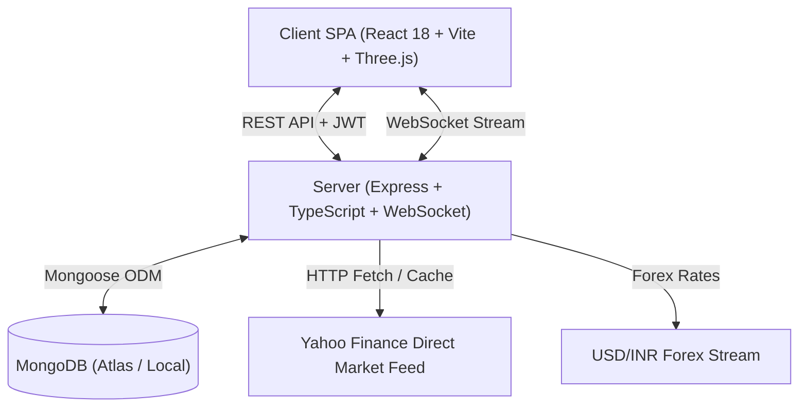

# StockPulse ⚡

**Institutional-Grade Market Intelligence, Real-Time Paper Trading & AI Financial Analyst**

[](https://www.typescriptlang.org/)
[](https://reactjs.org/)
[](https://nodejs.org/)
[](https://www.mongodb.com/)
[](https://tailwindcss.com/)
[](https://threejs.org/)
[](LICENSE)

StockPulse is a production-quality, full-stack financial platform that combines **live global & Indian market data**, an **authoritative paper trading execution engine**, **institutional risk analytics**, a **deterministic strategy backtester**, and a **grounded AI market intelligence suite** wrapped in a responsive 3D glassmorphic user interface.

---

## 📑 Table of Contents

- [Core Features](#-core-features)
- [Multi-Currency & Indian Market Engine](#-multi-currency--indian-market-engine)
- [Grounded AI Intelligence Suite](#-grounded-ai-intelligence-suite)
- [Strategy Lab & Backtesting Engine](#-strategy-lab--backtesting-engine)
- [Institutional Risk & Stress Testing](#-institutional-risk--stress-testing)
- [Technology Stack](#-technology-stack)
- [System Architecture](#-system-architecture)
- [Repository Structure](#-repository-structure)
- [REST API Reference](#-rest-api-reference)
- [Getting Started & Local Development](#-getting-started--local-development)
- [Cloud Deployment (Render & Atlas)](#-cloud-deployment-render--atlas)
- [Regulatory & Educational Boundary](#-regulatory--educational-boundary)

---

## 🌟 Core Features

### 1. Real-Time Market Data Stream
- **Zero Fabricated Prices**: Connects directly to verified live market feeds (Yahoo Finance direct stream & Twelve Data adapters).
- **Global & Indian Equities**: Search and track US stocks (`AAPL`, `NVDA`, `MSFT`, `TSLA`, `SPY`, `QQQ`) and Indian NSE/BSE equities (`RELIANCE.NS`, `TCS.NS`, `INFY.NS`, `HDFCBANK.NS`, `TATAMOTORS.NS`, `^NSEI`, `^BSESN`).
- **Data Freshness Engine**: Transparent badges (`LIVE`, `DELAYED`, `MARKET_CLOSED`, `UNAVAILABLE`) calculated from trading session timestamps.
- **Interactive OHLCV Charts**: Interactive range selection (`1D`, `5D`, `1M`, `6M`, `1Y`, `5Y`) with volume bars, moving averages, and crosshair tooltips.
- **Financial News & Sentiment**: Real-time headline feed parsed through a financial sentiment heuristic (Bullish, Neutral, Bearish scoring).

### 2. Authoritative Paper Trading Engine
- **$100,000 Starting Virtual Capital**: Every registered trader starts with virtual cash to practice risk management.
- **Full Order Lifecycle**: Supports `MARKET BUY`, `MARKET SELL`, `LIMIT BUY`, and `LIMIT SELL` orders.
- **Server-Side Validation**: Atomic cash deduction, weighted average entry price calculation, and holdings verification.
- **Pending Limit Order Matching**: Background daemon continuously checks and fills pending limit orders against fresh market quotes.
- **Execution Ledger**: Immutable audit log of every trade fill, realized P&L attribution, and execution timestamp.

### 3. Editorial Trade Journal & Stop-Loss Alerts
- **Trade Reflection Notebook**: Record your trading thesis, strategy pattern, entry/exit criteria, and emotional mindset (`DISCIPLINED`, `CONFIDENT`, `NEUTRAL`, `ANXIOUS`, `FOMO`).
- **Server-Evaluated Price Alerts**: Set stop-loss and take-profit triggers evaluated server-side against live price feeds.

### 4. Premium 3D Glassmorphic Interface
- **Modern Design Language**: Soft lavender palette (`#F2EEFF`) with deep indigo accents (`#4B1FA8`) and emerald/rose indicators.
- **Interactive 3D Visuals**: Powered by Three.js and React Three Fiber (`MarketCore`, `SentimentOrb`, `PortfolioRing`, `StrategyCube`, and dynamic particle fields).
- **Full Mobile Responsiveness**: Responsive navigation drawer, dropdown menus, touch-optimized trade modals, and auto-collapsing data tables.

---

## 🇮🇳 Multi-Currency & Indian Market Engine

StockPulse features a dedicated **Dual-Currency Conversion Engine** (`USD` & `INR`):

- **Live USD/INR Forex Feed**: Automatically streams live exchange rates from `USDINR=X`.
- **Native Asset Awareness**: Automatically identifies if a stock is traded natively in **INR** (NSE/BSE equities) or **USD** (US equities).
  - *Indian Stocks (e.g. Reliance ₹2,950)*: Displays native ₹2,950 in INR mode without false rate multiplication, and converts accurately to $34.91 in USD mode.
  - *US Stocks (e.g. Apple $220)*: Displays native $220 in USD mode, and converts to ₹18,590 in INR mode.
- **Indian Number Formatting**: Formats large Indian currency figures in **Lakhs (L)** and **Crores (Cr)** alongside international Billions (B)/Millions (M) formats.
- **Multi-Currency Paper Trading**: Execute trades on Indian stocks seamlessly with automatic account base currency normalization.

---

## 🤖 Grounded AI Intelligence Suite

StockPulse includes an **AI Financial Analyst** powered by verifiable RAG (Retrieval-Augmented Generation) grounded in live market and portfolio state:

```
┌────────────────────────────────────────────────────────┐
│               StockPulse AI Analyst                    │
├────────────────────────────────────────────────────────┤
│ • Portfolio Grounding   : Analyzes your active holdings│
│ • Live Price Validation : Pulls real-time quotes       │
│ • "Why Did It Move?"    : Explains price volatility    │
│ • Sentiment Analysis    : Assesses news tone & impact  │
│ • Stock Comparison      : Side-by-side fundamentals    │
│ • Prompt Templates      : Pre-built financial questions│
└────────────────────────────────────────────────────────┘
```

- **Zero Hallucination Grounding**: Pulls verified facts from internal data providers (`getPortfolio`, `getPosition`, `getQuote`, `getNews`, `getSentiment`, `getRisk`, `getTradeHistory`).
- **Structured Explanations**: Distinguishes between **Observed Market Facts**, **Contributing Factors**, and **Uncertainty Statements**.

---

## 🧪 Strategy Lab & Backtesting Engine

Create, test, and validate quantitative trading algorithms before risking capital:

- **Built-In Strategy Presets**:
  - `SMA Crossover`: Fast and Slow simple moving average golden/death cross.
  - `RSI Mean Reversion`: Buy oversold dips (<30) and sell overbought rallies (>70).
  - `Momentum Trend Follower`: Breakout trend tracking with dynamic volume filters.
  - `Donchian Breakout`: 20-day high/low channel range breakouts.
- **Deterministic Backtester**: Runs strategies over historical daily bars and compares the simulated equity curve against a passive **Buy & Hold Benchmark**.
- **Performance Analytics**: Computes Total Return %, Win Rate %, Maximum Drawdown %, Profit Factor, and Total Trades executed.

---

## 📊 Institutional Risk & Stress Testing

Evaluate portfolio health with metrics used by professional hedge funds and risk managers:

- **Annualized Volatility**: Measures standard deviation of daily return swings across held assets.
- **Herfindahl-Hirschman Index (HHI)**: Quantifies portfolio concentration risk and warns of over-allocation to single names.
- **Maximum Drawdown**: Real-time high-water mark tracking showing peak-to-trough decline.
- **Historical Stress Testing**: Simulates portfolio impacts against macro events (-15% Market Crash, -10% Correction, +10% Bull Surge).
- **Interactive Shock Simulator**: Allows custom macroeconomic percentage shocks to preview projected portfolio value in real time.

---

## 💻 Technology Stack

| Layer | Technologies |
|---|---|
| **Frontend UI** | React 18, TypeScript, Vite, Tailwind CSS, Framer Motion, Lucide Icons |
| **3D & Graphics** | Three.js, React Three Fiber (`@react-three/fiber`), React Three Drei (`@react-three/drei`), Canvas Confetti |
| **Financial Charts** | Recharts (Area Charts, Line Charts, Bar Charts, Composition Charts) |
| **Backend Server** | Node.js (v18+), Express, TypeScript (`NodeNext` ESM), WebSocket (`ws`) |
| **Database & ORM** | MongoDB Atlas / Local MongoDB, Mongoose 8 |
| **Security & Auth** | JSON Web Tokens (JWT), Bcrypt password hashing, Zod schema validation |
| **Market Data** | Yahoo Finance Direct Stream, Loughran-McDonald Sentiment Lexicon, USD/INR Forex Stream |
| **Deployment** | Render Web Services, Unified Build Pipeline, `render.yaml` Blueprint |

---

## 🏗️ System Architecture



---

## 📁 Repository Structure

```text
StockPulse/
├── client/                     # Frontend SPA Application
│   ├── src/
│   │   ├── components/         # 3D Canvases, Charts, Common UI, Modals, Navbar
│   │   ├── context/            # AuthContext, CurrencyContext (USD/INR conversion)
│   │   ├── pages/              # Dashboard, Markets, Detail, Trade, Portfolio,
│   │   │                       # StrategyLab, Risk, AIAnalyst, Journal, Alerts
│   │   ├── services/           # Axios API Client & WebSocket Subscribers
│   │   ├── types/              # TypeScript Data Contracts & Interfaces
│   │   ├── App.tsx             # Route Configuration
│   │   └── main.tsx            # React Root Mount
│   ├── package.json
│   └── vite.config.ts
├── server/                     # Backend API & Trading Engine
│   ├── src/
│   │   ├── config/             # DB Connection & Environment Config
│   │   ├── middleware/         # Auth Middleware & Error Handling
│   │   ├── models/             # User, Account, Position, Order, Trade, Strategy, Alert
│   │   ├── providers/          # Market & News Providers (Yahoo Finance, Twelve Data)
│   │   ├── routes/             # Auth, Market, Order, Trade, Portfolio, AI, Strategy
│   │   ├── services/           # TradingEngine, PortfolioService, AIService, RiskService
│   │   ├── tests/              # Trading Engine & Strategy Backtest Unit Tests
│   │   └── index.ts            # Express Entrypoint & Static SPA Hosting
│   ├── package.json
│   └── tsconfig.json
├── package.json                # Root Workspace & Build Scripts
├── render.yaml                 # Render Cloud Deployment Blueprint
└── README.md                   # Project Documentation
```

---

## 🔌 REST API Reference

### Authentication
- `POST /api/auth/register` — Register a new account with $100k starting virtual cash.
- `POST /api/auth/login` — Authenticate user and receive JWT bearer token.
- `GET /api/auth/me` — Retrieve current authenticated user profile.
- `GET /api/auth/account` — Retrieve current paper trading account balances.

### Markets & Forex
- `GET /api/markets/search?q=:query` — Search for stock symbols and tickers.
- `GET /api/markets/overview` — Get market status, benchmark universe quotes, and news.
- `GET /api/markets/forex/usd-inr` — Live USD to INR conversion rate.
- `GET /api/markets/:symbol/quote` — Real-time price, day high/low, and volume quote.
- `GET /api/markets/:symbol/history` — Historical OHLCV candle bars (`1d`, `1mo`, `1y`, etc.).
- `GET /api/markets/:symbol/news` — Verified financial news articles for a symbol.
- `GET /api/markets/:symbol/sentiment` — Sentiment distribution and average score.

### Trading & Orders
- `POST /api/orders` — Place a simulated order (`BUY`/`SELL`, `MARKET`/`LIMIT`).
- `GET /api/orders` — Retrieve active and historical orders.
- `DELETE /api/orders/:id` — Cancel a pending limit order.
- `GET /api/trades` — Execution ledger of filled trades with realized P&L.

### Portfolio & Risk
- `GET /api/portfolio/summary` — Full portfolio overview, mark-to-market total value, cash, and P&L.
- `GET /api/portfolio/positions` — Active security positions with weighted entry prices.
- `GET /api/portfolio/performance` — Historical equity curve snapshots.
- `GET /api/portfolio/risk` — Volatility, beta, HHI concentration score, and stress scenarios.

### AI Intelligence
- `POST /api/ai/query` — Interactive AI financial query with live portfolio & quote grounding.
- `GET /api/ai/brief` — Daily macro market brief and sentiment summary.
- `GET /api/ai/why-moved/:symbol` — In-depth causal explanation for single-day price volatility.

---

## 🚀 Getting Started & Local Development

### Prerequisites
- **Node.js** (v18.0.0 or higher)
- **npm** (v9.0.0 or higher)
- **MongoDB** (Local instance on `mongodb://localhost:27017` or a MongoDB Atlas URI)

### 1. Clone the Repository
```bash
git clone https://github.com/rupamghosh3000/Bnb26_TeamName_Internal_Round.git
cd StockPulse
```

### 2. Configure Environment Variables
Create a `.env` file in the root directory:
```env
PORT=5000
NODE_ENV=development
WEB_URL=http://localhost:5173
MONGODB_URI=mongodb://localhost:27017/stockpulse
JWT_SECRET=your_super_secret_jwt_key_stockpulse_2026
MARKET_DATA_PROVIDER=primary
AI_PROVIDER=internal
```

### 3. Install Dependencies
```bash
# Install root, server, and client dependencies
npm run postinstall
```

### 4. Run Unit & Strategy Tests
```bash
npm test
```

### 5. Start Development Servers
```bash
# Starts both Backend (Port 5000) and Frontend (Port 5173) concurrently
npm run dev
```

Visit **http://localhost:5173** to access the application.

---

## ☁️ Cloud Deployment (Render & Atlas)

StockPulse includes a unified production build configuration designed for **Render** or any standard cloud container:

1. **Push to GitHub**: Push your repository to GitHub.
2. **MongoDB Atlas Setup**:
   - Create a cluster on [MongoDB Atlas](https://www.mongodb.com/cloud/atlas).
   - In **Network Access**, add `0.0.0.0/0` (Allow access from anywhere).
   - Copy your connection string (e.g., `mongodb+srv://<user>:<password>@cluster0.mongodb.net/stockpulse?retryWrites=true&w=majority`).
3. **Render Blueprint Deployment**:
   - In Render, click **New +** -> **Blueprint**.
   - Connect your GitHub repository (it will automatically read [`render.yaml`](file:///c:/Users/LENOVA/Downloads/StockPulse/render.yaml)).
   - Set the `MONGODB_URI` environment variable with your Atlas URI.
4. **Unified Static Serving**: The backend automatically compiles and serves the client's production bundle directly from `client/dist`, providing a unified, single-port deployment on Render Free/Starter tiers.

---

## ⚖️ Regulatory & Educational Boundary

> **IMPORTANT DISCLAIMER**
> StockPulse is an **educational paper-trading and market-intelligence simulator**. All portfolio values, balances, orders, executions, and profits/losses are strictly virtual and simulated using real-world public market feeds. StockPulse does **not** handle real money, does **not** execute live broker-dealer transactions, and does **not** provide personalized financial advice.
